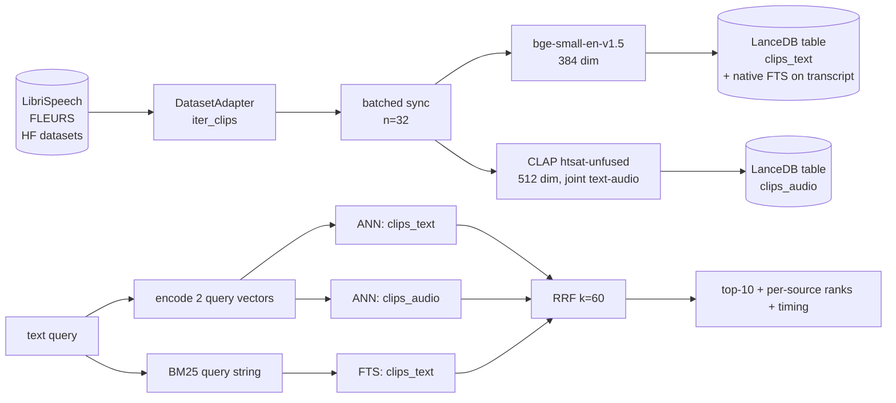
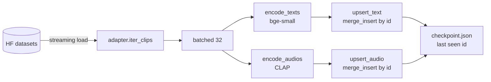
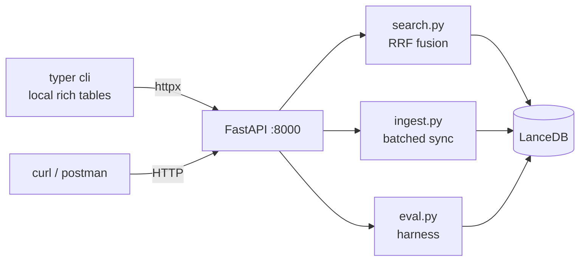

# audio-search

Hybrid text + audio embedding retrieval over speech datasets, with a transcript-as-gold evaluation harness.

> **TL;DR.** Speech-first retrieval over LibriSpeech (and FLEURS in the same shape). Three retrieval sources — `bge-small` over transcripts, CLAP over waveforms, BM25 over the transcript text — fused via Reciprocal Rank Fusion. Eval against 110 transcript-as-gold probes shows the **headline result that naive 3-way RRF underperforms text-only on this corpus**: the audio source is uncorrelated with text-substring queries and drags R@1 from 0.81 to 0.10. The interesting design lesson is content-dependent fusion, not a single best stack.

---

## Problem framing

Build a small backend that lets you search a growing audio corpus by text query, returning ranked clips. Dataset is monotonically growing; design must extend to 10–100× without rewrites. End-of-day deliverable: working demo, system-design doc, eval framework, tradeoffs.

| Concern | Choice |
|---|---|
| Primary content | English speech (transcripts shipped as gold labels) |
| Datasets | LibriSpeech `dev-clean` (primary), FLEURS `en_us` (accent/locale variety) |
| Stretch datasets | AudioCaps (general audio + captions) — deferred, not run |
| Search mode | Text query → top-k clips, with audio-to-audio also wired |
| Eval philosophy | Transcripts ARE gold. No human labelling; no LLM-as-judge for v1. |

CommonVoice was the original plan; Mozilla pulled all CV repos from HuggingFace in October 2025 and moved access to the new Mozilla Data Collective. FLEURS replaces it (multilingual + accent-tagged + still on HF).

---

## Architecture



The three retrieval signals run in parallel; client-side RRF fuses ranked lists. Same shape for `/search` and `/search-by-audio` (latter just swaps the query encoder).

---

## Stack

| Layer | Choice | Why |
|---|---|---|
| Runtime | Python 3.12, `uv` | One process; PyTorch-native; fastest installs |
| Service | FastAPI + uvicorn | 5 endpoints, async OK, type-checked |
| CLI | Typer + Rich | Thin httpx client over the service |
| Text encoder | `BAAI/bge-small-en-v1.5` (384-dim) | Top-tier MTEB retrieval at ~5 ms/CPU |
| Audio encoder | `laion/clap-htsat-unfused` (512-dim) | Joint text-audio space → text can query audio directly |
| Vector store | **LanceDB** (Apache 2.0, embedded) | Local, zero infra, native FTS + filters |
| Fusion | RRF, k=60 (Cormack 2009) | No score calibration, no training data needed |

Originally planned on Turbopuffer; pivoted to LanceDB after confirming Turbopuffer has no free tier. `src/audio_search/index.py` is the only file that changed. See [ADR 0004](docs/adr/0004-vector-store-lancedb.md).

---

## Eval — transcript-as-gold

### Probe sets

| Set | n | Construction |
|---|---|---|
| `auto` | 100 | random clip → 3–7-word sub-phrase of its transcript → query; gold = source clip |
| `hand` | 10 | curated paraphrase / topical / abstract queries; gold = clip id by hand |

Probes are seeded (seed=42) so re-runs are exactly comparable.

### Configs (ablation)

| Config | Sources fused |
|---|---|
| `baseline` | text-vec only |
| `+audio`   | text-vec + audio-vec |
| `+bm25`    | text-vec + audio-vec + bm25 |

### Results (200-clip LibriSpeech index, 110 probes)

**Overall**

| config | R@1 | R@5 | R@10 | MRR |
|---|---:|---:|---:|---:|
| baseline | **0.791** | 0.918 | 0.946 | **0.847** |
| +audio | 0.100 | 0.500 | 0.864 | 0.262 |
| +bm25 | 0.618 | **0.946** | **0.973** | 0.757 |

**Auto probes (substring queries, n=100)**

| config | R@1 | R@5 | R@10 | MRR |
|---|---:|---:|---:|---:|
| baseline | **0.81** | 0.93 | 0.95 | **0.865** |
| +audio | 0.09 | 0.50 | 0.86 | 0.257 |
| +bm25 | 0.64 | **0.97** | **0.99** | 0.776 |

**Hand probes (paraphrase + abstract, n=10)**

| config | R@1 | R@5 | R@10 | MRR |
|---|---:|---:|---:|---:|
| baseline | **0.60** | **0.80** | **0.90** | **0.662** |
| +audio | 0.20 | 0.50 | 0.90 | 0.313 |
| +bm25 | 0.40 | 0.70 | 0.80 | 0.567 |

### Reading the table

- **Text-only baseline is the single best R@1 source** on this corpus. Adding more signals via naive equal-weighted RRF hurts top-1 because the new sources disagree with the strong text signal.
- **+audio is catastrophic for R@1** (0.81 → 0.09 on substring queries). The audio space is uncorrelated with text-substring queries — the audio rank of the gold clip is essentially random against alternates, and RRF dilutes the strong text signal.
- **+bm25 climbs R@5 / R@10** (0.93 → 0.97 / 0.95 → 0.99) but drops R@1. BM25 over substrings is unambiguous when keywords match, but its rank-1 winner sometimes disagrees with the text-dense rank-1 winner, costing R@1.
- **Hand probes (paraphrase) flatten everyone.** Text-dense leads (0.60) because paraphrases share semantics, not keywords (so BM25 loses); audio still drags.

This is the headline finding the eval was built to surface: **on speech with clean transcripts, equal-weighted RRF over (text, audio, bm25) is the wrong default.** The right designs are (a) text-only, or (b) cascaded — text-dense first stage, BM25 deep-recall, audio as a *re-ranker* over a candidate set rather than a fusion partner.

This is the same content-dependent split flagged in research:
- Transcript-only retrieval reaches NDCG@10 ≈ 0.52–0.61 on podcast retrieval (TU Wien TREC Podcast 2021), so transcript-first is genuinely strong on clean speech.
- Whisper hallucinates ~1 % on clean speech but **40 %** on non-speech, dumping 55 % of clips to the token "so" (arXiv:2501.11378). On non-speech / mixed corpora, audio embeddings are not optional.

We are firmly in the "clean speech" regime here — and the eval confirms exactly what the literature predicts.

### Per-probe inspection

Each `/search` response carries `text_rank`, `audio_rank`, `bm25_rank` per hit + timing per stage. The CLI renders them, so during demo:

```
$ uv run audio-search search "joining the military"
…  rrf=0.0335  t=0  a=18  b=2   ls_1988_24833…  "i've decided to enlist in the army"
…
```

Lets you tell a story per query — "audio rank 18 for this paraphrase = audio doesn't see the semantic link, only the acoustic profile."

---

## Ingestion pipeline



- **Idempotent.** `clip_id` is deterministic (`ls_<spk>_<chap>_<utt>`, `fl_<config>_<row>`). LanceDB `merge_insert` is no-op on unchanged content.
- **Resumable.** On crash, `ingest --resume` skips ids in checkpoint.
- **Batched.** 32 clips per encoder call amortises MPS/GPU launch overhead.
- **Observed throughput.** ~21 clips/sec on M-series MPS (200 clips in 9.4 s).

What this design **does not** include but should at scale: real queue (Pub/Sub / SQS), Prefect / Ray DAG runner, DLQ, neural audio fingerprint dedup before embed, multi-GPU embed pool. See [ADR 0009](docs/adr/0009-stretch-and-future-work.md).

---

## API + CLI



| Method | Path | What |
|---|---|---|
| `GET` | `/health` | model load status, table sizes |
| `POST` | `/ingest` | `{dataset, limit, batch_size, resume, skip_audio}` |
| `GET` | `/search` | `?q=&k=10&sources=text,audio,bm25&source_filter=` |
| `POST` | `/search-by-audio` | audio-to-audio (CLAP over input waveform) |
| `POST` | `/eval` | runs probes × configs, writes `eval/results.json` |
| `GET` | `/clip/{id}` | metadata + transcript + audio_path; `?play=1` streams the wav |

CLI examples:

```bash
audio-search health
audio-search ingest --dataset librispeech --limit 200
audio-search search "joining the military" --k 5
audio-search search-by-audio data/librispeech_audio/ls_xxx.wav --k 5
audio-search eval --n 100
```

---

## Key code

`search.py` is small enough to inline.

```python
def rrf(ranked_lists, k=60, top_k=10):
    scores = defaultdict(float)
    for ranked in ranked_lists:
        for rank, doc_id in enumerate(ranked):
            scores[doc_id] += 1.0 / (k + rank)
    return sorted(scores.items(), key=lambda kv: -kv[1])[:top_k]

def search(query, top_k=10, sources=("text", "audio", "bm25"), where=None):
    ranked = {}
    if "text" in sources:
        ranked["text"]  = query_text(encode_texts([query])[0],   top_k=30, where=where)
    if "audio" in sources:
        ranked["audio"] = query_audio(encode_text_for_audio_space([query])[0], top_k=30, where=where)
    if "bm25" in sources:
        ranked["bm25"]  = query_bm25(query, top_k=30, where=where)
    fused = rrf([[r["id"] for r in ranked[s]] for s in ranked], k=60, top_k=top_k)
    # … attach per-source ranks + timing
```

`embed.py` exposes three encoder calls, all memoized on first use:

- `encode_texts(list[str]) -> (N, 384)` via `bge-small-en-v1.5`
- `encode_audios(list[Path]) -> (N, 512)` via CLAP audio tower
- `encode_text_for_audio_space(list[str]) -> (N, 512)` via CLAP text tower (joint space)

`index.py` wraps LanceDB with a stable function surface (`upsert_text`, `upsert_audio`, `query_text`, `query_audio`, `query_bm25`, `namespace_counts`, `get_by_id`) so swapping the vector store later touches only this file.

---

## Decisions

Nine ADRs in `docs/adr/`. One-liner per:

| ID | Decision |
|---|---|
| [0001](docs/adr/0001-python-runtime.md) | Python everywhere (uv + FastAPI + PyTorch); no Node sidecar |
| [0002](docs/adr/0002-shipped-transcripts.md) | Use shipped transcripts; keep `Transcriber` interface for Whisper later |
| [0003](docs/adr/0003-embedding-models.md) | `bge-small-en-v1.5` (text) + `laion/clap-htsat-unfused` (audio) |
| [0004](docs/adr/0004-vector-store-lancedb.md) | LanceDB, two tables, mirrored attributes; supersedes Turbopuffer plan |
| [0005](docs/adr/0005-fusion-rrf.md) | RRF, k=60, three ranked lists |
| [0006](docs/adr/0006-eval-transcript-as-gold.md) | Transcript-as-gold + auto sub-phrase + hand probes; R@k + MRR; ablation |
| [0007](docs/adr/0007-ingestion-batched-sync.md) | Batched sync, idempotent merge_insert, local checkpoint |
| [0008](docs/adr/0008-api-http-plus-cli.md) | FastAPI primary + thin Typer CLI client |
| [0009](docs/adr/0009-stretch-and-future-work.md) | Stretch goals (audio-to-audio shipped; AudioCaps deferred); future-work backlog |

---

## Tradeoffs made for time

- **No CommonVoice.** Mozilla pulled HF repos Oct 2025; FLEURS used as the multi-accent stand-in. CV access via Mozilla Data Collective is a stretch.
- **No Whisper-in-the-loop.** Shipped transcripts only. WER on dev-clean is ~2 %; retrieval results would be unchanged.
- **Equal-weighted RRF.** Eval shows it loses to text-only on this corpus. Did not implement weighted RRF or cascaded re-ranking — that needs labelled tuning data or a cross-encoder, both out-of-scope for a day. The eval **table makes this an explicit lesson** rather than a hidden bug.
- **No drift / online eval.** Probe set is offline only; no continuous monitor.
- **No AudioCaps.** Deferred per gating decision in [ADR 0009](docs/adr/0009-stretch-and-future-work.md); audio-to-audio shipped from day 1 because it's ~20 LOC against the same `clips_audio` table.
- **No web UI.** CLI + curl is the demo surface; HTTP contract is documented so a UI can plug in.
- **No reranker.** Cohere Rerank / `bge-reranker-base` were considered ([ADR 0009](docs/adr/0009-stretch-and-future-work.md)). On 6–10-word transcripts the cross-encoder edge collapses; deferred.

---

## Next investments

In rough priority order if we had another day:

1. **Replace naive RRF with a cascade**: text-dense → top-100 → BM25 re-rank → top-30 → CLAP audio re-rank → top-10. Lets each source do what it's good at.
2. **Tune RRF weights / k per source** with a small held-out probe set. Either weighted RRF or per-source k.
3. **Add ECAPA-TDNN speaker embeddings** as a fourth retrieval source for speaker / accent queries that transcripts cannot represent.
4. **Real queue-based ingestion** (Pub/Sub → Beam/Klio shape — Spotify's pattern). Replace the sync `for` loop without touching consumers.
5. **AudioCaps subset + non-speech probes.** CLAP earns its slot on non-speech; without it the audio source looks bad on this benchmark.
6. **LLM-as-judge** for paraphrase queries with multi-relevant gold (Recall@k is a binary; nDCG@k with graded judgments is more informative).
7. **Embedding versioning + drift monitor.** Tag every vector with `(model_id, model_version)`; track top-K cosine distribution against a baseline; alert on > 2 σ drift.
8. **Audio fingerprint dedup** before embedding (Spotify-style topological / neural fingerprints) — at corpus scales > 10⁵ the dedup pass dominates ingestion cost.

---

## References

Background reading that shaped the design. Span-grounded notes live at `.scratch/audio-embeddings-at-scale/notes/` and were compiled into the design draft.

**Embedding models**
- LAION-CLAP — `laion/clap-htsat-unfused`, joint text-audio in 512 dim, ~0.2B params; trained on LAION-Audio-630K. <https://huggingface.co/laion/clap-htsat-unfused>
- `BAAI/bge-small-en-v1.5` — 384-dim text encoder, top-tier MTEB retrieval at CPU speed. <https://huggingface.co/BAAI/bge-small-en-v1.5>
- Whisper-large-v3 — 1550 M-param ASR encoder; 128-mel input at 16 kHz; lineage context for transcript pipelines. <https://huggingface.co/openai/whisper-large-v3>
- WavLM-large — 94 k hr SSL on Libri-Light + GigaSpeech + VoxPopuli; the speech-side alternative to Whisper-encoder. <https://huggingface.co/microsoft/wavlm-large>
- ECAPA-TDNN (SpeechBrain) — 0.80 % EER on VoxCeleb1; future fourth signal for speaker queries. <https://huggingface.co/speechbrain/spkrec-ecapa-voxceleb>
- SONAR (Meta) — 1024-dim joint speech-text sentence embeddings across 200+ languages; cited in [ADR 0009](docs/adr/0009-stretch-and-future-work.md) as the multilingual upgrade. <https://huggingface.co/facebook/SONAR>

**Production retrospectives**
- Spotify — "Introducing Natural Language Search for Podcast Episodes" (2022). Dense retrieval deployed *alongside* Elasticsearch, not replacing it. <https://engineering.atspotify.com/2022/03/introducing-natural-language-search-for-podcast-episodes>
- Spotify Klio (Beam on Google Dataflow) — large-binary ingestion pattern; cut catalog downsampling from 4 weeks to 6 days at 4× lower cost. <https://cloud.google.com/blog/products/data-analytics/try-spotifys-internal-os-tool-for-media-processing-in-beam/>
- AWS Nova Multimodal Embeddings — explicitly argues against transcript-only retrieval because tone / emotion / musical cues are linguistically invisible. <https://aws.amazon.com/blogs/machine-learning/a-practical-guide-to-amazon-nova-multimodal-embeddings/>
- Pinterest Manas / OmniSearchSage — reusable EBR framework decoupling embedding choice from serving infra. <https://medium.com/pinterest-engineering/manas-hnsw-realtime-powering-realtime-embedding-based-retrieval-dc71dfd6afdd>

**Counter-positions (research grounding for the eval finding)**
- "Indexing full ASR transcripts significantly improves retrieval effectiveness in terms of relevance, particularly when assessed against full transcript relevance (NDCG@10 of 0.52 for full transcript index and 0.61 for combined transcript+metadata index)" — TU Wien, TREC Podcast 2021 retrospective. <https://link.springer.com/chapter/10.1007/978-3-031-88714-7_9>
- "Whisper-large-v3 tends to misinterpret non-speech sounds as filler words or markers, with as much as 55.2 % of the audios being transcribed into 'so'. … hallucinations appeared 40.3 % of the time across 301 317 inferences on non-speech content" — arXiv:2501.11378. <https://arxiv.org/html/2501.11378v1>

**Fusion**
- "RRF often matches or outperforms more complex learning-based fusion methods" — Cormack et al., SIGIR 2009. <https://www.researchgate.net/publication/221301121>

**Eval framework**
- SUPERB — speech-community evaluation protocols (QbE / STD with MTWV). <https://arxiv.org/abs/2105.01051>
- MSEB — eight-task audio-embedding benchmark (Google Research, 2026). <https://arxiv.org/abs/2602.07143>
- Audio Retrieval with Natural Language Queries — AudioCaps / Clotho R@1/5/10 + mAP@10 protocol (the standard we'd adopt for AudioCaps stretch). <https://arxiv.org/abs/2105.02192>

---

## Setup

```bash
git clone <repo>
cd audio-search
cp .env.example .env                          # nothing required by default
uv sync                                       # installs Python 3.12 + deps

# (optional) HF token for any gated dataset later
uv run hf auth login

# start the service
uv run uvicorn audio_search.api:app --port 8000

# ingest, search, eval
audio-search ingest --dataset librispeech --limit 200
audio-search search "joining the military" --k 5
audio-search eval --n 100
```

Tests:

```bash
uv run pytest tests/ -q
```

---

## Layout

```
audio-search/
├── README.md                          # this file
├── pyproject.toml                     # uv-managed deps
├── .env.example                       # LanceDB path + model overrides
├── docs/adr/                          # 9 ADRs
├── src/audio_search/
│   ├── config.py                      # pydantic-settings, device auto-detect
│   ├── adapters/                      # base.py + librispeech.py + fleurs.py
│   ├── embed.py                       # 3 encoder calls, memoized
│   ├── index.py                       # LanceDB wrapper (2 tables, native FTS)
│   ├── search.py                      # parallel 3-source + RRF
│   ├── ingest.py                      # batched sync + checkpoint
│   ├── eval.py                        # probe gen + Recall@k + MRR
│   ├── api.py                         # FastAPI
│   └── cli.py                         # Typer + Rich
├── tests/test_rrf.py
├── eval/
│   ├── hand_probes.json               # 10 curated paraphrase / topical probes
│   └── results.json                   # persisted ablation table
└── data/                              # git-ignored: lancedb + audio cache
```
