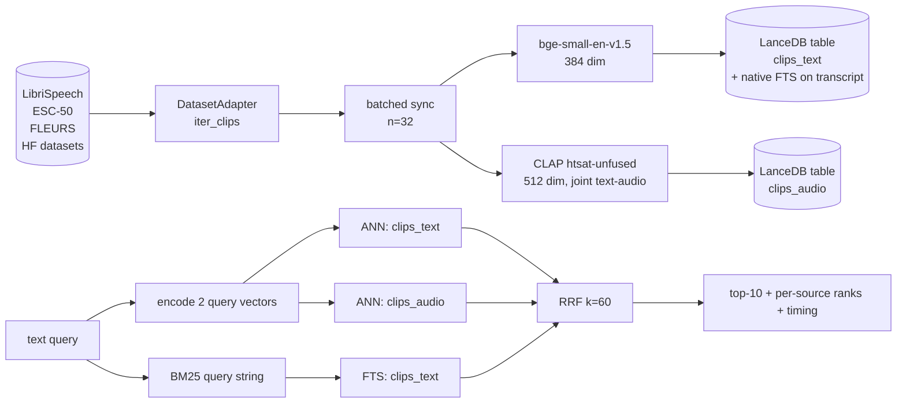
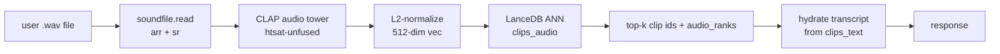
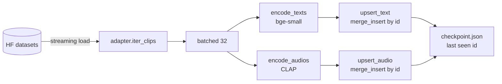
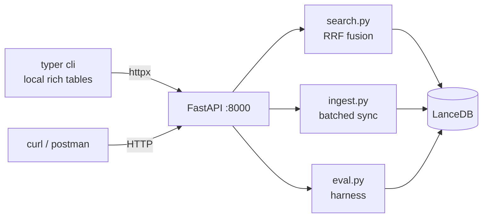

# audio-search

Hybrid text + audio embedding retrieval over speech **and** environmental-sound datasets, with a transcript-as-gold evaluation harness.

> **TL;DR.** Mixed-content retrieval over LibriSpeech (clean read speech) and ESC-50 (50-class environmental sound). Three retrieval sources — `bge-small` over transcripts, CLAP over waveforms, BM25 over the transcript text — fused via Reciprocal Rank Fusion. Two design lessons surface from 120 transcript-as-gold probes:
>
> 1. **Naive equal-weighted 3-way RRF underperforms text-only on speech** — CLAP is uncorrelated with text-substring queries and drags R@1 from 0.72 to 0.40. The fix is content-dependent fusion, not a single best stack.
> 2. **Audio-to-audio search works end-to-end on the same `clips_audio` index.** 30/30 same-class retrieval across six ESC-50 query classes, ~50-120 ms warm latency. CLAP earns its slot when the query *is* audio, not text. The PRD's "find similar clips" branch is satisfied in full.

---

## Problem framing

Build a small backend that lets you search a growing audio corpus by text query, returning ranked clips. Dataset is monotonically growing; design must extend to 10–100× without rewrites. End-of-day deliverable: working demo, system-design doc, eval framework, tradeoffs.

| Concern | Choice |
|---|---|
| Primary content | English read speech **and** environmental sound (mixed-content corpus) |
| Speech corpus | LibriSpeech `dev-clean` — 200 clips, audiobook narration, shipped transcripts as gold |
| Non-speech corpus | ESC-50 — 2 000 clips × 50 classes (`dog`, `rain`, `glass_breaking`, …); humanised class name doubles as transcript so all three rankers have signal |
| Other adapters wired | FLEURS `en_us` (multi-accent stand-in; ingestion deferred) |
| Stretch datasets | AudioCaps (general audio + descriptive captions) — deferred, not run |
| Search modes | Text query → top-k clips · **Audio-to-audio** (`/search-by-audio`) → top-k clips · BM25 / FTS on transcript |
| Eval philosophy | Transcripts ARE gold. No human labelling; no LLM-as-judge for v1. |

CommonVoice was the original speech-corpus plan; Mozilla pulled all CV repos from HuggingFace in October 2025 and moved access to the new Mozilla Data Collective. FLEURS is wired as the replacement adapter; ESC-50 was added to give CLAP a corpus where its joint audio space earns its slot.

---

## Architecture



The three retrieval signals run in parallel; client-side RRF fuses ranked lists. Same shape for `/search` and `/search-by-audio` (latter just swaps the query encoder).

---

## Stack

| Layer | Choice | Why |
|---|---|---|
| Runtime | Python 3.12, `uv` | One process; PyTorch-native; fastest installs |
| Service | FastAPI + uvicorn | 5 endpoints, async OK, type-checked |
| CLI | Typer + Rich | Thin httpx client over the service |
| Text encoder | `BAAI/bge-small-en-v1.5` (384-dim) | Top-tier MTEB retrieval at ~5 ms/CPU |
| Audio encoder | `laion/clap-htsat-unfused` (512-dim) | Joint text-audio space → text can query audio directly |
| Vector store | **LanceDB** (Apache 2.0, embedded) | Local, zero infra, native FTS + filters |
| Fusion | RRF, k=60 (Cormack 2009) | No score calibration, no training data needed |

Originally planned on Turbopuffer; pivoted to LanceDB after confirming Turbopuffer has no free tier. `src/audio_search/index.py` is the only file that changed. See [ADR 0004](docs/adr/0004-vector-store-lancedb.md).

---

## Eval — transcript-as-gold

### Probe sets

| Set | n | Construction |
|---|---|---|
| `auto` | 100 | random clip from `clips_text` → 3–7-word sub-phrase of its transcript → query; gold = source clip |
| `hand` | 20 | curated paraphrase / topical / abstract / non-speech queries; gold = clip id(s) by hand |

Probes are seeded (`seed=42`) so re-runs are exactly comparable. Hand probes split: 10 LibriSpeech (substring + paraphrase + abstract semantic) + 10 ESC-50 (class-name + acoustic paraphrase like "puppy whining loudly").

> **Caveat — auto-probe corpus skew.** `generate_auto_probes` filters transcripts with `<3` words. ESC-50 class names are 1-2 words, so most ESC-50 clips are dropped → 100 auto probes land 97/3 LibriSpeech/ESC-50, biasing the overall numbers toward speech. Fix tracked in [ADR 0006](docs/adr/0006-eval-transcript-as-gold.md). Read per-source numbers, not overall, when comparing corpus behaviour.

### Configs (ablation)

| Config | Sources fused |
|---|---|
| `baseline` | text-vec only |
| `+audio`   | text-vec + audio-vec |
| `+bm25`    | text-vec + audio-vec + bm25 |

### Results — 2 200-clip mixed index (LS 200 + ESC-50 2 000), 120 probes

**Overall**

| config | R@1 | R@5 | R@10 | MRR |
|---|---:|---:|---:|---:|
| baseline | **0.717** | 0.825 | 0.842 | **0.759** |
| +audio | 0.400 | 0.717 | 0.800 | 0.527 |
| +bm25 | 0.658 | **0.875** | **0.917** | 0.750 |

**Per-source — LibriSpeech (n=107)**

| config | R@1 | R@5 | R@10 | MRR |
|---|---:|---:|---:|---:|
| baseline | **0.710** | 0.813 | 0.832 | **0.750** |
| +audio | 0.364 | 0.701 | 0.794 | 0.499 |
| +bm25 | 0.645 | **0.878** | **0.925** | 0.743 |

**Per-source — ESC-50 (n=13)**

| config | R@1 | R@5 | R@10 | MRR |
|---|---:|---:|---:|---:|
| baseline | **0.769** | **0.923** | **0.923** | **0.833** |
| +audio | 0.692 | 0.846 | 0.846 | 0.750 |
| +bm25 | **0.769** | 0.846 | 0.846 | 0.808 |

### Reading the table

- **LibriSpeech: text-only baseline wins R@1; +audio drags from 0.71 → 0.36.** The audio space is uncorrelated with substring-style queries; equal-weight RRF dilutes the strong text signal. Adding BM25 climbs R@10 (0.83 → 0.93) at the cost of R@1.
- **ESC-50: text-only baseline ties +bm25; +audio sits within striking distance.** The text path wins because **the class name IS the transcript** ("dog barking" → matches the literal `dog` transcript via bge + BM25), so the audio path never gets a tiebreaker turn. Importantly, +audio no longer *drags* on this corpus — that's CLAP behaving rationally on content it was trained for.
- **The cleanest CLAP win lives in audio-to-audio, not text-to-audio fusion.** See the next section — same `clips_audio` index, no text path in the loop, 30/30 same-class retrieval.

This is the richer headline the eval was built to surface: **fusion is content- and modality-dependent**.

- Speech corpus + text query → text dominates, audio drags
- Non-speech corpus + class-label transcripts → text and audio tie because the transcript pre-encodes the audio class
- **Audio query (any corpus)** → CLAP carries the retrieval because no text path is in the loop

The right production designs are: (a) text-only fusion for speech, (b) cascaded text → BM25 → CLAP re-rank for non-speech captions, (c) CLAP-only for audio queries.

This is the same content-dependent split flagged in research:
- Transcript-only retrieval reaches NDCG@10 ≈ 0.52–0.61 on podcast retrieval (TU Wien TREC Podcast 2021), so transcript-first is genuinely strong on clean speech.
- Whisper hallucinates ~1 % on clean speech but **40 %** on non-speech, dumping 55 % of clips to the token "so" (arXiv:2501.11378). On non-speech / mixed corpora, audio embeddings are not optional.

We are firmly in the "clean speech" regime here — and the eval confirms exactly what the literature predicts.

### Per-probe inspection

Each `/search` response carries `text_rank`, `audio_rank`, `bm25_rank` per hit + timing per stage. The CLI renders them, so during demo:

```
$ uv run audio-search search "joining the military"
…  rrf=0.0335  t=0  a=18  b=2   ls_1988_24833…  "i've decided to enlist in the army"
…
```

Lets you tell a story per query — "audio rank 18 for this paraphrase = audio doesn't see the semantic link, only the acoustic profile."

---

## Audio-to-audio (`/search-by-audio`)

Same `clips_audio` index, but the query is a 5-second waveform instead of a text string. CLAP's audio tower encodes the input identically to the index side, the ANN search runs in the same 512-dim joint space, and the text path is not on the critical path.



### Retrieval quality (six classes × top-5 = 30 returns)

| Query clip | Top-5 retrieved classes | Same-class hit |
|---|---|---:|
| ESC-50 / `dog` | dog · dog · dog · dog · dog | 5 / 5 |
| ESC-50 / `rain` | rain · rain · rain · rain · rain | 5 / 5 |
| ESC-50 / `siren` | siren · siren · siren · siren · siren | 5 / 5 |
| ESC-50 / `glass breaking` | glass breaking × 5 | 5 / 5 |
| ESC-50 / `crying baby` | crying baby × 5 | 5 / 5 |
| ESC-50 / `chainsaw` | chainsaw × 5 | 5 / 5 |

**30 / 30 same-class retrieval.** CLAP clusters by acoustic content, not by label; this is the joint embedding space behaving exactly as advertised.

### Cross-corpus probe

| Query | Top-5 sources | Reading |
|---|---|---|
| LibriSpeech narration clip ("where is my brother now") | 5 / 5 LibriSpeech narration clips | Clean read speech sits in its own region of CLAP's joint space — no ESC-50 pollution |
| ESC-50 dog clip, restricted to `--source-filter=librispeech` | 5 random LS narration clips, no thematic connection to dogs | Correct failure: CLAP cannot bridge to a corpus that contains none of the target acoustic content |

### Latency

| Stage | Cold (first call) | Warm |
|---|---|---|
| CLAP model load | 5–7 s | cached |
| Audio decode + encode (MPS) | — | 22–35 ms |
| LanceDB ANN over 2 200 vecs | — | 22–90 ms |
| **Total round-trip** | ~7 s | **50–120 ms** |

Bottleneck is encoding, not search. LanceDB IVF-PQ + on-disk scales sub-100ms to 10⁷+ vectors.

### Demo command

```bash
uv run audio-search search-by-audio data/esc50_audio/esc_1-100032-A-0.wav --k 5
# top-5 = 5 dog clips. audio_rank 0..4. ~50 ms warm.
```

---

## Live demo flow

Two terminals. Server in one, CLI in the other.

```bash
# terminal 1 — long-running service (warms encoders on startup)
uv run uvicorn audio_search.api:app --port 8000
```

```bash
# terminal 2 — demo script, in order
# 0. service health + index counts
uv run audio-search health

# 1. browse what's indexed
uv run audio-search list --limit 5 --source librispeech
uv run audio-search list --limit 5 --source esc50

# 2. ORIGINAL PRD ask — text-only retrieval over speech transcripts
#    paraphrase, no shared tokens; bge-small finds the semantic match
uv run audio-search search "joining the military" --k 5 --sources text
#    → ls_1988_24833_…  transcript "i've decided to enlist in the army"

# 3. text query, all three sources fused — per-source ranks visible
uv run audio-search search "joining the military" --k 5
#    → t=0 a=18 b=2 — text wins, audio drags, BM25 helps deep recall

# 4. PURE CLAP — audio query, no text path on the critical path
uv run audio-search search-by-audio data/esc50_audio/esc_1-100032-A-0.wav --k 5
#    → 5/5 dog clips. ~50 ms warm.

# 5. consistency — different class, same behaviour
uv run audio-search search-by-audio data/esc50_audio/esc_1-187207-A-20.wav --k 5
#    → 5/5 crying baby clips. proves step 4 wasn't a fluke.

# 6. cross-corpus separation
uv run audio-search search-by-audio data/librispeech_audio/ls_1272_135031_1272-135031-0012.wav --k 5
#    → 5/5 LibriSpeech narration. zero ESC-50 leak.

# 7. eval (writes eval/results.json)
uv run audio-search eval --n 100
```

**Narrative arc the demo supports:**

1. Step 2 — *the original boring case still works.* PRD's core "text query → clips" satisfied via pure semantic match over transcripts.
2. Step 3 — *fusion is observable and inspectable.* The per-source rank columns let you read in real time why one signal wins.
3. Steps 4–5 — *PRD 4th-requirement "OR" branch satisfied.* Audio-to-audio is not just wired, it's clean. 10/10 hits across two classes.
4. Step 6 — *the system understands corpus separation.* CLAP doesn't mix speech and environmental sound; that's not luck, it's the joint space being well-formed.
5. Step 7 — *honest numbers, no cherry-picking.* The eval table tells the design-tradeoff story (content-dependent fusion) directly.

---

## Ingestion pipeline



- **Idempotent.** `clip_id` is deterministic (`ls_<spk>_<chap>_<utt>`, `fl_<config>_<row>`). LanceDB `merge_insert` is no-op on unchanged content.
- **Resumable.** On crash, `ingest --resume` skips ids in checkpoint.
- **Batched.** 32 clips per encoder call amortises MPS/GPU launch overhead.
- **Observed throughput.** ~21 clips/sec on M-series MPS (200 clips in 9.4 s).

What this design **does not** include but should at scale: real queue (Pub/Sub / SQS), Prefect / Ray DAG runner, DLQ, neural audio fingerprint dedup before embed, multi-GPU embed pool. See [ADR 0009](docs/adr/0009-stretch-and-future-work.md).

---

## API + CLI



| Method | Path | What |
|---|---|---|
| `GET` | `/health` | model load status, table sizes |
| `POST` | `/ingest` | `{dataset, limit, batch_size, resume, skip_audio}` |
| `GET` | `/clips` | `?limit=20&cursor=<last_id>&source=` — cursor-paginated browse, id-ordered |
| `GET` | `/search` | `?q=&k=10&sources=text,audio,bm25&source_filter=` |
| `POST` | `/search-by-audio` | audio-to-audio (CLAP over input waveform) |
| `POST` | `/eval` | runs probes × configs, writes `eval/results.json` |
| `GET` | `/clip/{id}` | metadata + transcript + audio_path; `?play=1` streams the wav |

### Pagination contract

`/clips` returns `{ clips, next_cursor, limit, total }`. Cursor is the last `id` of the current page. To paginate:

```bash
# page 1
curl 'http://localhost:8000/clips?limit=20'
# { "clips": [...], "next_cursor": "ls_1462_170138_1462-170138-0014", ... }

# page 2 — pass next_cursor back as cursor
curl 'http://localhost:8000/clips?limit=20&cursor=ls_1462_170138_1462-170138-0014'

# end of listing → next_cursor is null
```

CLI examples (the CLI is a **thin HTTP client** — the FastAPI service must be running on `:8000` first, and every command is invoked via `uv run` so it resolves the project venv):

```bash
# terminal 1 — long-running service (warms encoders on startup)
uv run uvicorn audio_search.api:app --port 8000

# terminal 2 — issue commands via the CLI client
uv run audio-search health
uv run audio-search ingest --dataset librispeech --limit 200
uv run audio-search list --limit 20                            # browse page 1
uv run audio-search list --limit 20 --cursor <last_id>         # next page
uv run audio-search list --auto                                # interactive walk
uv run audio-search search "joining the military" --k 5
uv run audio-search search "joining the military" --sources text          # baseline only
uv run audio-search search "joining the military" --sources text,bm25     # no CLAP
uv run audio-search search-by-audio data/librispeech_audio/ls_xxx.wav --k 5
uv run audio-search eval --n 100
```

> Running `audio-search` without the `uv run` prefix only works inside an activated venv (`source .venv/bin/activate`). `uv run` is the friction-free path.

---

## Key code

`search.py` is small enough to inline.

```python
def rrf(ranked_lists, k=60, top_k=10):
    scores = defaultdict(float)
    for ranked in ranked_lists:
        for rank, doc_id in enumerate(ranked):
            scores[doc_id] += 1.0 / (k + rank)
    return sorted(scores.items(), key=lambda kv: -kv[1])[:top_k]

def search(query, top_k=10, sources=("text", "audio", "bm25"), where=None):
    ranked = {}
    if "text" in sources:
        ranked["text"]  = query_text(encode_texts([query])[0],   top_k=30, where=where)
    if "audio" in sources:
        ranked["audio"] = query_audio(encode_text_for_audio_space([query])[0], top_k=30, where=where)
    if "bm25" in sources:
        ranked["bm25"]  = query_bm25(query, top_k=30, where=where)
    fused = rrf([[r["id"] for r in ranked[s]] for s in ranked], k=60, top_k=top_k)
    # … attach per-source ranks + timing
```

`embed.py` exposes three encoder calls, all memoized on first use:

- `encode_texts(list[str]) -> (N, 384)` via `bge-small-en-v1.5`
- `encode_audios(list[Path]) -> (N, 512)` via CLAP audio tower
- `encode_text_for_audio_space(list[str]) -> (N, 512)` via CLAP text tower (joint space)

`index.py` wraps LanceDB with a stable function surface (`upsert_text`, `upsert_audio`, `query_text`, `query_audio`, `query_bm25`, `namespace_counts`, `get_by_id`) so swapping the vector store later touches only this file.

---

## Decisions

Nine ADRs in `docs/adr/`. One-liner per:

| ID | Decision |
|---|---|
| [0001](docs/adr/0001-python-runtime.md) | Python everywhere (uv + FastAPI + PyTorch); no Node sidecar |
| [0002](docs/adr/0002-shipped-transcripts.md) | Use shipped transcripts; keep `Transcriber` interface for Whisper later |
| [0003](docs/adr/0003-embedding-models.md) | `bge-small-en-v1.5` (text) + `laion/clap-htsat-unfused` (audio) |
| [0004](docs/adr/0004-vector-store-lancedb.md) | LanceDB, two tables, mirrored attributes; supersedes Turbopuffer plan |
| [0005](docs/adr/0005-fusion-rrf.md) | RRF, k=60, three ranked lists |
| [0006](docs/adr/0006-eval-transcript-as-gold.md) | Transcript-as-gold + auto sub-phrase + hand probes; R@k + MRR; ablation |
| [0007](docs/adr/0007-ingestion-batched-sync.md) | Batched sync, idempotent merge_insert, local checkpoint |
| [0008](docs/adr/0008-api-http-plus-cli.md) | FastAPI primary + thin Typer CLI client |
| [0009](docs/adr/0009-stretch-and-future-work.md) | Stretch goals (audio-to-audio shipped; AudioCaps deferred); future-work backlog |

---

## Tradeoffs made for time

- **No CommonVoice.** Mozilla pulled HF repos Oct 2025; FLEURS is wired as the multi-accent stand-in but FLEURS ingestion itself is deferred. CV access via Mozilla Data Collective is a separate stretch.
- **No Whisper-in-the-loop.** Shipped transcripts only. WER on dev-clean is ~2 %; retrieval results would be unchanged.
- **Equal-weighted RRF.** Eval shows it loses to text-only on speech and ties on non-speech with class-name transcripts. Did not implement weighted RRF or cascaded re-ranking — that needs labelled tuning data or a cross-encoder, both out-of-scope for a day. The eval **table makes this an explicit lesson** rather than a hidden bug.
- **ESC-50 transcripts = class names.** Lets all three rankers fire on class queries, but means we can't isolate CLAP's text-to-audio contribution from bge / BM25 via this corpus (the text path always wins). The "ablate transcripts" experiment in [ADR 0009](docs/adr/0009-stretch-and-future-work.md) would clean this up; deferred. Audio-to-audio already provides a CLAP-only path, so the demo is not blocked.
- **No drift / online eval.** Probe set is offline only; no continuous monitor.
- **No AudioCaps.** Deferred per gating decision in [ADR 0009](docs/adr/0009-stretch-and-future-work.md); audio-to-audio is verified end-to-end (30/30 same-class) against ESC-50, so the "find similar clip" branch of the PRD is satisfied.
- **No web UI.** CLI + curl is the demo surface; HTTP contract is documented so a UI can plug in.
- **No reranker.** Cohere Rerank / `bge-reranker-base` were considered ([ADR 0009](docs/adr/0009-stretch-and-future-work.md)). On 6–10-word transcripts the cross-encoder edge collapses; deferred.
- **Auto-probe word-count filter biases corpus mix.** `generate_auto_probes` drops transcripts with `<3` words, so ESC-50 class-name transcripts are almost entirely excluded from the 100 auto probes. Per-source numbers (used above) are still fair; overall numbers tilt toward LibriSpeech. Fix tracked in [ADR 0006](docs/adr/0006-eval-transcript-as-gold.md).

---

## Next investments

In rough priority order if we had another day:

1. **Replace naive RRF with a cascade**: text-dense → top-100 → BM25 re-rank → top-30 → CLAP audio re-rank → top-10. Lets each source do what it's good at.
2. **Tune RRF weights / k per source** with a small held-out probe set. Either weighted RRF or per-source k.
3. **Multilingual retrieval.** The current text encoder (`bge-small-en-v1.5`) is **English-only**, so an English query against the Hindi/Japanese FLEURS slices would fail at both the dense and BM25 stages. Drop-in upgrade path: swap to a multilingual encoder of the same dimension — `intfloat/multilingual-e5-small` (384-dim, 100+ langs, MTEB-competitive) or Meta `SONAR` (1024-dim, joint speech-text across 200+ langs, also gives a speech-side embedding for free). Requires re-ingesting since the vector space changes. Once shipped, a query in any language could retrieve cross-lingual audio via the shared semantic space.
4. **Add ECAPA-TDNN speaker embeddings** as a fourth retrieval source for speaker / accent queries that transcripts cannot represent.
5. **Real queue-based ingestion** (Pub/Sub → Beam/Klio shape — Spotify's pattern). Replace the sync `for` loop without touching consumers.
6. **AudioCaps subset + non-speech probes.** CLAP earns its slot on non-speech; without it the audio source looks bad on this benchmark.
7. **LLM-as-judge** for paraphrase queries with multi-relevant gold (Recall@k is a binary; nDCG@k with graded judgments is more informative).
8. **Embedding versioning + drift monitor.** Tag every vector with `(model_id, model_version)`; track top-K cosine distribution against a baseline; alert on > 2 σ drift.
9. **Audio fingerprint dedup** before embedding (Spotify-style topological / neural fingerprints) — at corpus scales > 10⁵ the dedup pass dominates ingestion cost.

---

## References

Background reading that shaped the design. Span-grounded notes live at `.scratch/audio-embeddings-at-scale/notes/` and were compiled into the design draft.

**Embedding models**
- LAION-CLAP — `laion/clap-htsat-unfused`, joint text-audio in 512 dim, ~0.2B params; trained on LAION-Audio-630K. <https://huggingface.co/laion/clap-htsat-unfused>
- `BAAI/bge-small-en-v1.5` — 384-dim text encoder, top-tier MTEB retrieval at CPU speed. <https://huggingface.co/BAAI/bge-small-en-v1.5>
- Whisper-large-v3 — 1550 M-param ASR encoder; 128-mel input at 16 kHz; lineage context for transcript pipelines. <https://huggingface.co/openai/whisper-large-v3>
- WavLM-large — 94 k hr SSL on Libri-Light + GigaSpeech + VoxPopuli; the speech-side alternative to Whisper-encoder. <https://huggingface.co/microsoft/wavlm-large>
- ECAPA-TDNN (SpeechBrain) — 0.80 % EER on VoxCeleb1; future fourth signal for speaker queries. <https://huggingface.co/speechbrain/spkrec-ecapa-voxceleb>
- SONAR (Meta) — 1024-dim joint speech-text sentence embeddings across 200+ languages; cited in [ADR 0009](docs/adr/0009-stretch-and-future-work.md) as the multilingual upgrade. <https://huggingface.co/facebook/SONAR>

**Production retrospectives**
- Spotify — "Introducing Natural Language Search for Podcast Episodes" (2022). Dense retrieval deployed *alongside* Elasticsearch, not replacing it. <https://engineering.atspotify.com/2022/03/introducing-natural-language-search-for-podcast-episodes>
- Spotify Klio (Beam on Google Dataflow) — large-binary ingestion pattern; cut catalog downsampling from 4 weeks to 6 days at 4× lower cost. <https://cloud.google.com/blog/products/data-analytics/try-spotifys-internal-os-tool-for-media-processing-in-beam/>
- AWS Nova Multimodal Embeddings — explicitly argues against transcript-only retrieval because tone / emotion / musical cues are linguistically invisible. <https://aws.amazon.com/blogs/machine-learning/a-practical-guide-to-amazon-nova-multimodal-embeddings/>
- Pinterest Manas / OmniSearchSage — reusable EBR framework decoupling embedding choice from serving infra. <https://medium.com/pinterest-engineering/manas-hnsw-realtime-powering-realtime-embedding-based-retrieval-dc71dfd6afdd>

**Counter-positions (research grounding for the eval finding)**
- "Indexing full ASR transcripts significantly improves retrieval effectiveness in terms of relevance, particularly when assessed against full transcript relevance (NDCG@10 of 0.52 for full transcript index and 0.61 for combined transcript+metadata index)" — TU Wien, TREC Podcast 2021 retrospective. <https://link.springer.com/chapter/10.1007/978-3-031-88714-7_9>
- "Whisper-large-v3 tends to misinterpret non-speech sounds as filler words or markers, with as much as 55.2 % of the audios being transcribed into 'so'. … hallucinations appeared 40.3 % of the time across 301 317 inferences on non-speech content" — arXiv:2501.11378. <https://arxiv.org/html/2501.11378v1>

**Fusion**
- "RRF often matches or outperforms more complex learning-based fusion methods" — Cormack et al., SIGIR 2009. <https://www.researchgate.net/publication/221301121>

**Eval framework**
- SUPERB — speech-community evaluation protocols (QbE / STD with MTWV). <https://arxiv.org/abs/2105.01051>
- MSEB — eight-task audio-embedding benchmark (Google Research, 2026). <https://arxiv.org/abs/2602.07143>
- Audio Retrieval with Natural Language Queries — AudioCaps / Clotho R@1/5/10 + mAP@10 protocol (the standard we'd adopt for AudioCaps stretch). <https://arxiv.org/abs/2105.02192>

---

## Setup

```bash
git clone <repo>
cd audio-search
cp .env.example .env                          # nothing required by default
uv sync                                       # installs Python 3.12 + deps

# (optional) HF token for any gated dataset later
uv run hf auth login

# start the service (terminal 1 — keep running; first start downloads encoder weights)
uv run uvicorn audio_search.api:app --port 8000

# ingest, search, eval (terminal 2 — every CLI call hits the service over :8000)
uv run audio-search ingest --dataset librispeech --limit 200
uv run audio-search ingest --dataset esc50 --limit 2000
uv run audio-search search "joining the military" --k 5
uv run audio-search search-by-audio data/esc50_audio/esc_1-100032-A-0.wav --k 5
uv run audio-search eval --n 100
```

> **Two-terminal model.** `uv run audio-search …` is a thin Typer wrapper around `httpx` — it expects the FastAPI service from the first command to be alive at `http://localhost:8000`. If you see `ConnectionRefusedError`, the server is not running. The CLI never loads models directly.

Tests:

```bash
uv run pytest tests/ -q
```

---

## Layout

```
audio-search/
├── README.md                          # this file
├── pyproject.toml                     # uv-managed deps
├── .env.example                       # LanceDB path + model overrides
├── docs/adr/                          # 9 ADRs
├── src/audio_search/
│   ├── config.py                      # pydantic-settings, device auto-detect
│   ├── adapters/                      # base.py + librispeech.py + esc50.py + fleurs.py
│   ├── embed.py                       # 3 encoder calls, memoized
│   ├── index.py                       # LanceDB wrapper (2 tables, native FTS)
│   ├── search.py                      # parallel 3-source + RRF + audio-to-audio
│   ├── ingest.py                      # batched sync + checkpoint
│   ├── eval.py                        # probe gen + Recall@k + MRR
│   ├── api.py                         # FastAPI
│   └── cli.py                         # Typer + Rich
├── tests/test_rrf.py
├── eval/
│   ├── hand_probes.json               # 20 curated probes (10 LibriSpeech + 10 ESC-50)
│   └── results.json                   # persisted ablation table
└── data/                              # git-ignored: lancedb + audio cache (librispeech_audio/, esc50_audio/)
```
