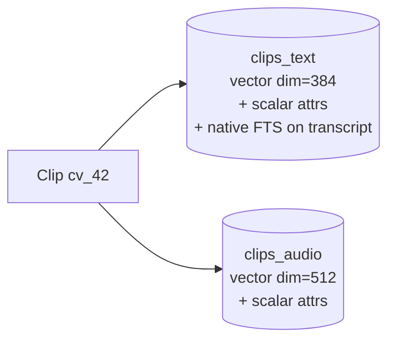

# ADR 0004 — Vector store: LanceDB, two tables, mirrored attributes

**Status:** Accepted · 2026-05-18 · Supersedes Turbopuffer plan (see "History")

## Decision

Use **LanceDB** (Apache 2.0, embedded, on-disk under `./data/lancedb/`) as the vector store. Two tables keyed by the same logical `id`:



Scalar attributes are **mirrored** in both tables so each table is independently queryable + filterable without a join.

## Context

Turbopuffer was the initial plan but is paid-only (no free tier as of 2026-05). For a 1 000-vector day-prototype we want offline, zero-cost, zero-infra storage with native BM25 and SQL-like metadata filters. LanceDB ticks every box: embedded, Apache 2.0, Arrow-native, batteries-included hybrid search.

A LanceDB **table** has a single fixed vector dimension per row, so two vectors per logical clip ⇒ two tables — same shape we would have used with tpuf namespaces.

## Schema (both tables)

```text
id           : string
vector       : fixed_size_list<float32, dim>   # 384 in clips_text, 512 in clips_audio
transcript   : string                          # FTS-indexed in clips_text only
speaker_id   : string
accent       : string
gender       : string
source       : string                          # commonvoice | librispeech | audiocaps
lang         : string
duration_s   : float32
audio_path   : string                          # local cache path, for playback
```

A native (non-Tantivy) FTS index is created over `transcript` in `clips_text` on first upsert; subsequent upserts re-use it.

## Alternatives

| Option | Why rejected |
|---|---|
| Turbopuffer | paid-only; introduces a network hop and an API key dependency for a demo that should run offline |
| ChromaDB | BM25 is first-class in 2026 but newer (less battle-tested than LanceDB FTS) |
| Qdrant (local docker) | BM25 via sparse-vector pattern needs an extra encoder pipeline; more code for the same outcome |
| Pinecone Starter (hosted free) | 2 GB / 5-index limit fine, but sparse-vector BM25 pattern + cloud round-trip again |
| FAISS | library only — no FTS, no metadata index, no upsert-by-id, no persistence story |

## Consequences

- Storage layer is a directory (`./data/lancedb/`). git-ignored; recreate any time by re-running `ingest`.
- Query path: parallel `tbl.search(qvec).limit(K)` on each table + `tbl.search(query_str, query_type="fts")` on `clips_text` → client-side RRF.
- Attribute mirror duplicates ~few hundred bytes per clip; trivial at 10⁴ clips.
- Migration to a hosted store later requires changing only `src/audio_search/index.py`; consumers (`search.py`, `ingest.py`, `api.py`) call a stable function surface (`upsert_*`, `query_*`, `namespace_counts`, `get_by_id`).

## History

- 2026-05-18 — chose Turbopuffer in the original grilling pass (managed, fast, hybrid built in)
- 2026-05-18 — pivoted to LanceDB after confirming Turbopuffer has no free tier; kept the same function surface in `index.py` so the rest of the code did not move
