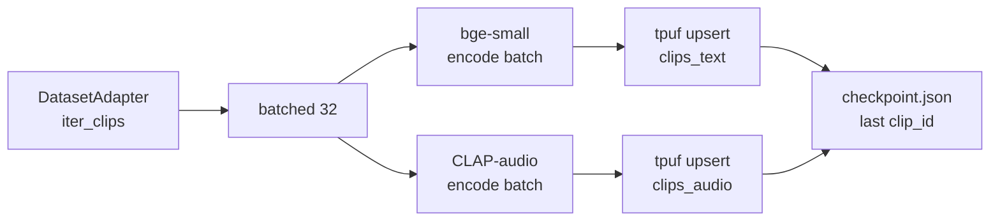

# ADR 0007 — Ingestion: batched sync script, idempotent upsert, local checkpoint

**Status:** Accepted · 2026-05-18

## Decision

Single Python entry point (`audio_search.ingest`) iterates a `DatasetAdapter`, batches 32 clips at a time, calls each encoder on the batch, upserts to both turbopuffer namespaces, and writes a checkpoint of the last successful `clip_id` to `eval/cache/checkpoint.json`.

## Context

Brief asks for an ingestion pipeline designed for 10–100× growth. A real queue-based system (Klio, Prefect, Ray) is the right shape at production scale but is 1+ day to build correctly. For a 4-hour budget, a batched sync script preserves the **interface** (an iterable adapter, idempotent upsert, replayable) without the infra cost.

## Properties

- **Idempotent.** `clip_id` is deterministic (`cv_<client>_<row>`, `ls_<spk>_<chap>_<utt>`). Re-upsert by id is a no-op for unchanged content.
- **Resumable.** On crash, re-run `ingest --resume` skips through the iterator up to the checkpoint.
- **Batched.** Embedding throughput is bottlenecked by encoder calls; batching at 32 amortises GPU/MPS launch overhead.
- **Backpressure (trivial).** Sync code has natural backpressure: next batch only starts after upsert returns.

## Alternatives

| Option | Why rejected for this prototype |
|---|---|
| Real queue (Klio / Pub/Sub / SQS) | infra setup ≈ several hours; no demo value at 1 000 clips |
| `asyncio` concurrent download + embed + upsert | marginal win at this scale; complicates failure attribution |
| Dataflow / Prefect / Ray | overkill; mentioned in [ADR 0009](0009-stretch-and-future-work.md) |

## Consequences

- ~80 LOC for the entire ingest module
- Re-runs are cheap; safe to ingest, evaluate, change config, ingest again
- Future-scale upgrade path: replace the iterator's `for` loop with a `concurrent.futures` pool, then a Ray Dataset, then a Beam pipeline — same `(load, embed, upsert)` decomposition at each step
