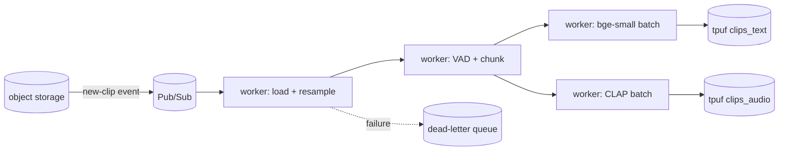

# ADR 0009 — Stretch goals and future-work directions

**Status:** Accepted · 2026-05-18

## Stretch goals (commit only after end-to-end green)

| Stretch | Effort | Gating |
|---|---|---|
| **Audio-to-audio search** (`/search-by-audio`) | ~20 LOC — embed input audio with CLAP, query `clips_audio`, return top-k | Free with current schema; deferred only until E2E demo passes a smoke run |
| **AudioCaps subset (300 clips)** | ~30 min — new adapter, captions stored in `caption` attribute (not `transcript`), retrieved via the same RRF path | Gated on hour-4 buffer; tests CLAP on non-speech content |

## Future work — what we'd build with more time

### Pipeline scale-out

Replace `for batch in ...` with a real DAG runner.

Concrete picks: Prefect or Dagster for the DAG, Ray Data for embedding parallelism, a DLQ for un-embeddable inputs.

### Retrieval upgrades

- **Cross-encoder reranker** over top-30 fused candidates. Two viable picks:
  - **Open weights:** `BAAI/bge-reranker-base`, runs locally, no API key
  - **Managed:** Cohere Rerank v3.5, ~200 ms/query, $1 per 1 k searches
  - **Why deferred for v1:** transcripts are short (≈ 6–10 words). Cross-attention's edge over `bge-small` collapses on tiny docs; rerank is most valuable on 200+ token documents. Adds latency + external dependency without a clean quality story on this corpus.
  - **When it earns its slot:** long-form clips (podcasts, lectures with multi-paragraph transcripts), or as a cheap rerank-as-judge for automated eval on un-labelled corpora.
- **Multi-vector / late interaction** (ColBERT-style) per chunk — useful once clips average > 30 s and a single mean-pooled vector loses temporal locality.
- **Speaker / accent embeddings** (ECAPA-TDNN, 192-dim) as a fourth retrieval source — directly answers "find clips by speaker / accent" queries that transcripts cannot represent.

### Evaluation

- **LLM-as-judge** for the no-transcript case (AudioCaps and stretch corpora), with the 4-point graded relevance prompt + few-shot anchors. Track judge-vs-human agreement on a sample to bound the ceiling effect.
- **Online drift monitor.** Daily 50-query probe set against the live index; alert on > 2 σ drop in Recall@5 vs baseline.
- **Synthetic-query expansion.** Beyond sub-phrase masking, generate paraphrases / counterfactuals with an LLM seeded by 10–20 human-written examples (Bonifacio et al. recipe).

### Production hardening

- **Embedding-versioning.** Treat embeddings as data; tag every vector with `(model_id, model_version)`; never mix versions in one namespace. Catches the "v1 vs v2 cosines are not comparable" failure mode.
- **Neural audio fingerprint dedup** before embedding — at scale, near-duplicates dominate batch-embed cost.
- **Filtered ANN** for multi-tenancy (`where org_id = ...`); turbopuffer supports server-side filters today.
