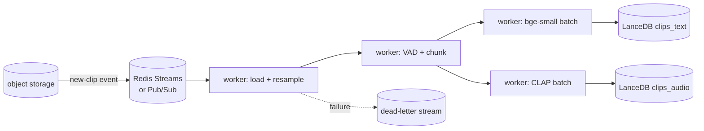

# ADR 0009 — Stretch goals and future-work directions

**Status:** Accepted · 2026-05-18 (revised — audio-to-audio + ESC-50 shipped; AudioCaps still deferred)

## Stretch goals — status

| Stretch | Status | Evidence |
|---|---|---|
| **Audio-to-audio search** (`/search-by-audio`) | **✓ Shipped + verified** | 30/30 same-class retrieval on six ESC-50 query classes; cross-corpus separation verified (LS query → LS results only); 50–120 ms warm round-trip on MPS. See README "Audio-to-audio" section. |
| **ESC-50 non-speech corpus** | **✓ Shipped** | 2 000 clips, 50 classes, ingested via new `ESC50Adapter`. Class name doubles as transcript so all three rankers fire. Lets CLAP demonstrate clean cluster behaviour at demo time. |
| **AudioCaps subset (300 clips)** | Deferred | ~30 min — new adapter, captions stored as transcript (descriptive sentences, unlike ESC-50 class labels), retrieved via the same RRF path. Would isolate CLAP's text-to-audio contribution that ESC-50's class-name transcripts shortcut around. |
| **Ablate-transcripts experiment on ESC-50** | Deferred | ~5 min code + ~90 s re-ingest. Stash transcripts before, restore after. Forces CLAP's text-tower to carry retrieval without bge / BM25 shortcut → cleanest measurement of joint-space cross-modal lift. |

## Future work — what we'd build with more time

### Pipeline scale-out

Replace `for batch in ...` with a queue + worker pool. Current ingest is sync + single-process; at ≥10⁴ clips it saturates CLAP on one MPS device.

Two candidate substrates, both swap-in-place via env var (no producer/consumer code changes):

- **Redis Streams** — single Docker container, `XREADGROUP` for consumer groups, `XACK` for at-least-once, `XPENDING` + `XCLAIM` for crash recovery, second stream for DLQ. ~150 LOC. Lowest-friction local setup; matches Discord / GitLab production patterns.
- **GCP Pub/Sub Emulator** — matches Spotify Klio (cited above), `gcloud beta emulators pubsub` to run locally, same `google-cloud-pubsub` Python client as prod. ~250 LOC. Highest production-fidelity story.

Concrete picks for the wider DAG: Prefect or Dagster for orchestration, Ray Data for embedding parallelism, a DLQ stream for un-embeddable inputs, idempotent `merge_insert` on `clip_id` for safe redelivery.

### Retrieval upgrades

- **Cross-encoder reranker** over top-30 fused candidates. Two viable picks:
  - **Open weights:** `BAAI/bge-reranker-base`, runs locally, no API key
  - **Managed:** Cohere Rerank v3.5, ~200 ms/query, $1 per 1 k searches
  - **Why deferred for v1:** transcripts are short (≈ 6–10 words). Cross-attention's edge over `bge-small` collapses on tiny docs; rerank is most valuable on 200+ token documents. Adds latency + external dependency without a clean quality story on this corpus.
  - **When it earns its slot:** long-form clips (podcasts, lectures with multi-paragraph transcripts), or as a cheap rerank-as-judge for automated eval on un-labelled corpora.
- **Multi-vector / late interaction** (ColBERT-style) per chunk — useful once clips average > 30 s and a single mean-pooled vector loses temporal locality.
- **Speaker / accent embeddings** (ECAPA-TDNN, 192-dim) as a fourth retrieval source — directly answers "find clips by speaker / accent" queries that transcripts cannot represent.

### Evaluation

- **LLM-as-judge** for the no-transcript case (AudioCaps and stretch corpora), with the 4-point graded relevance prompt + few-shot anchors. Track judge-vs-human agreement on a sample to bound the ceiling effect.
- **Online drift monitor.** Daily 50-query probe set against the live index; alert on > 2 σ drop in Recall@5 vs baseline.
- **Synthetic-query expansion.** Beyond sub-phrase masking, generate paraphrases / counterfactuals with an LLM seeded by 10–20 human-written examples (Bonifacio et al. recipe).

### Production hardening

- **Embedding-versioning.** Treat embeddings as data; tag every vector with `(model_id, model_version)`; never mix versions in one namespace. Catches the "v1 vs v2 cosines are not comparable" failure mode.
- **Neural audio fingerprint dedup** before embedding — at scale, near-duplicates dominate batch-embed cost.
- **Filtered ANN** for multi-tenancy (`where org_id = ...`); LanceDB supports server-side scalar filters today (`_where_to_sql` in `index.py`).
- **Multilingual text encoder swap.** `bge-small-en-v1.5` is English-only; cross-lingual retrieval over FLEURS hi/de/ja requires `intfloat/multilingual-e5-small` (drop-in same dimension) or Meta `SONAR` (1024-dim, joint speech-text across 200+ languages). Re-ingest required since the vector space changes.
